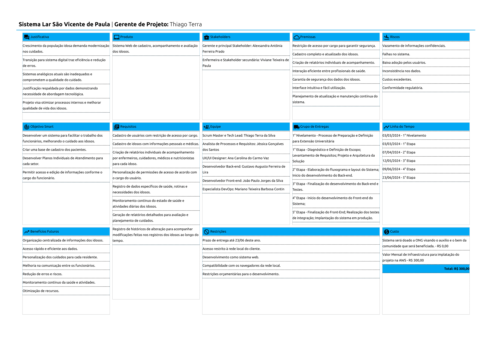
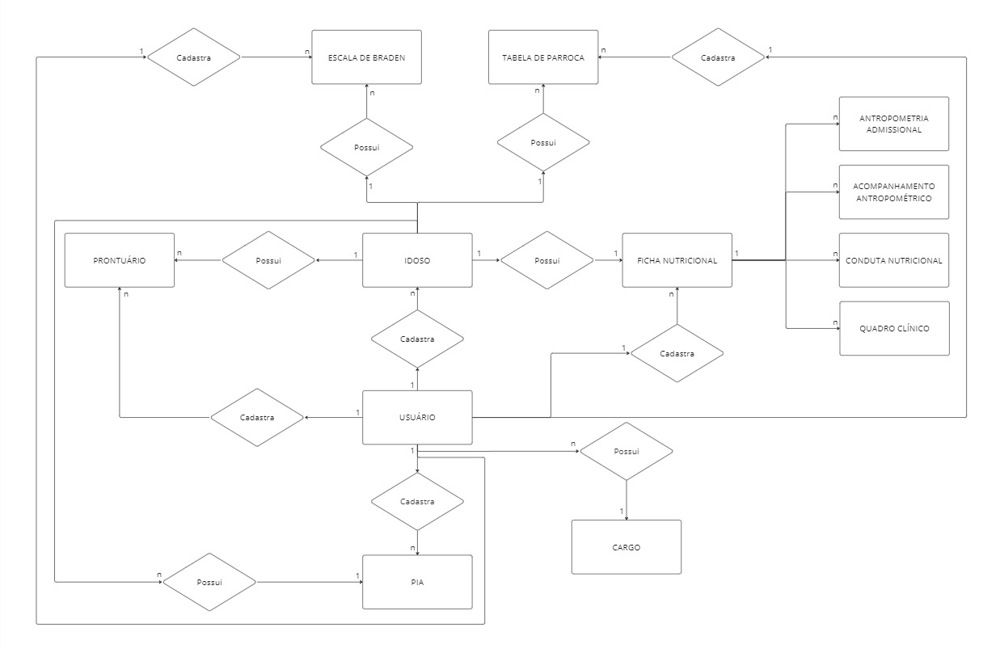

# Especificações do Projeto

Pré-requisitos: <a href="1-Documentação de Contexto.md"> Documentação de Contexto</a>

Por meio da técnica de observação e brainstorming foram analisadas as necessidades dos usuários do sistema de forma a atender suas demandas.

## Arquitetura e Tecnologias

No projeto em questão, será adotada uma abordagem robusta e eficiente no que diz respeito ao armazenamento e gerenciamento de dados. Para tal, será utilizado um **banco de dados PostgreSQL**, estruturado e manipulado através do **framework Prisma**. Este conjunto oferece uma base sólida e confiável para a persistência e manipulação dos dados essenciais ao sistema.

Além disso, para a gestão segura de autenticação e autorização, será integrado ao projeto um **banco de dados Redis**. Esse banco será responsável pelo armazenamento de tokens de autenticação, garantindo um processo de login seguro e eficiente para os usuários do sistema.

No que diz respeito à construção da API, optamos pelo **framework NestJS** em conjunto com TypeScript. Essa escolha proporciona um ambiente de desenvolvimento altamente escalável, com uma estrutura organizada e orientada a padrões que facilita a criação e manutenção de APIs complexas.

Já para a construção do front-end do sistema, será utilizado o **framework NextJS**, novamente em conjunto com TypeScript. Essa combinação oferece uma experiência de desenvolvimento moderna e eficiente, possibilitando a criação de interfaces de usuário dinâmicas e responsivas.

Para garantir a segurança da conexão em redes locais dos clientes, será implementado um **middleware de IP Safelist**. Esse middleware terá a função de bloquear o acesso a partir de redes externas não autorizadas, reforçando assim a proteção dos dados e recursos do sistema contra acessos não autorizados.

Além das tecnologias mencionadas anteriormente, é importante destacar que todo o back-end do sistema será encapsulado em **Docker Containers**. Essa abordagem proporciona uma maior portabilidade e consistência do ambiente de desenvolvimento para o ambiente de produção.

Ao utilizar contêineres Docker, cada componente do back-end, será isolado em um ambiente controlado e independente. Isso simplifica o processo de implantação, escalabilidade e manutenção do sistema, permitindo uma gestão mais eficiente dos recursos e uma maior confiabilidade operacional.

A integração do Docker também facilita a colaboração entre os membros da equipe de desenvolvimento, garantindo que todos estejam trabalhando em um ambiente consistente e reproduzível. Essa abordagem contribui significativamente para a estabilidade e escalabilidade do projeto, proporcionando uma infraestrutura flexível e altamente automatizada.

## Project Model Canvas

## Requisitos

No projeto, sua estrutura e suas funções são determinadas a partir dos requisitos funcionais e não-funcionais.

Os requisitos funcionais podem ser definidos como a descrição das funções que os usuários poderão utilizar para satisfazer suas necessidades. Já os requisitos não funcionais são aqueles que descrevem as características de usabilidade e outros aspectos que o site necessita apresentar de maneira geral.

Portanto, com os estudos das personas e histórias dos usuários identificadas para o projeto, foram definidos os seguintes requisitos.

### Requisitos Funcionais

| ID     | Descrição do Requisito                                | Prioridade |
| ------ | ----------------------------------------------------- | -----------|
| RF-001 | Permitir cadastro de usuários com diferentes funções  | ALTA       |
| RF-002 | Emitir relatórios relacionados ao paciente            | ALTA       |
| RF-003 | Emitir alertas de reavaliação para os profissionais   | ALTA       |
| RF-004 | Controle de entrada e baixa de estoque                | BAIXA      |

### Requisitos não Funcionais

| ID      | Descrição do Requisito                                            | Prioridade |
| ------- | ----------------------------------------------------------------- | ---------- |
| RNF-001 | O sistema deve ser responsivo para rodar em um dispositivos móveis| MÉDIA      |
| RNF-002 | Deve ser uma aplicação web                                        | BAIXA      |
| RNF-003 | Acesso à aplicação apenas na rede interna da empresa              | ALTA       |

## Restrições

O projeto está restrito pelos itens apresentados na tabela a seguir.

| ID  | Restrição                                             |
| --- | ----------------------------------------------------- |
| 01  | Prazo de entrega até 23/06 deste a ano.               |
| 02  | Acesso restrito à rede local do cliente.              |
| 03  | Desenvolvimento como sistema web.                     |
| 04  | Compatibilidade com os navegadores da rede local.     |
| 05  | Restrições orçamentárias para o desenvolvimento.      |

## Diagrama de Casos de Uso

O diagrama de casos de uso é o próximo passo após a elicitação de requisitos, que utiliza um modelo gráfico e uma tabela com as descrições sucintas dos casos de uso e dos atores. Ele contempla a fronteira do sistema e o detalhamento dos requisitos funcionais com a indicação dos atores, casos de uso e seus relacionamentos.

As referências abaixo irão auxiliá-lo na geração do artefato “Diagrama de Casos de Uso”.

> **Links Úteis**:
>
> - [Criando Casos de Uso](https://www.ibm.com/docs/pt-br/elm/6.0?topic=requirements-creating-use-cases)
> - [Como Criar Diagrama de Caso de Uso: Tutorial Passo a Passo](https://gitmind.com/pt/fazer-diagrama-de-caso-uso.html/)
> - [Lucidchart](https://www.lucidchart.com/)
> - [Astah](https://astah.net/)
> - [Diagrams](https://app.diagrams.net/)

## Modelo ER (Projeto Conceitual)

O modelo ER abaixo representa através de um diagrama como as entidades do sistema de relacionam entre si na aplicação, através deste também é possível verificar a cardinalidade entre as relações.

## Projeto da Base de Dados

O projeto da base de dados corresponde à representação das entidades e relacionamentos identificadas no Modelo ER, no formato de tabelas, com colunas e chaves primárias/estrangeiras necessárias para representar corretamente as restrições de integridade.

